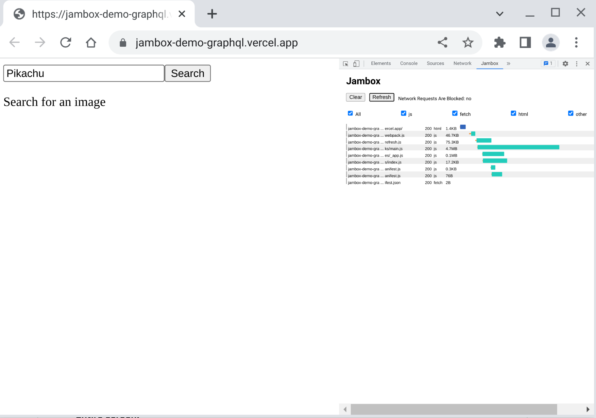
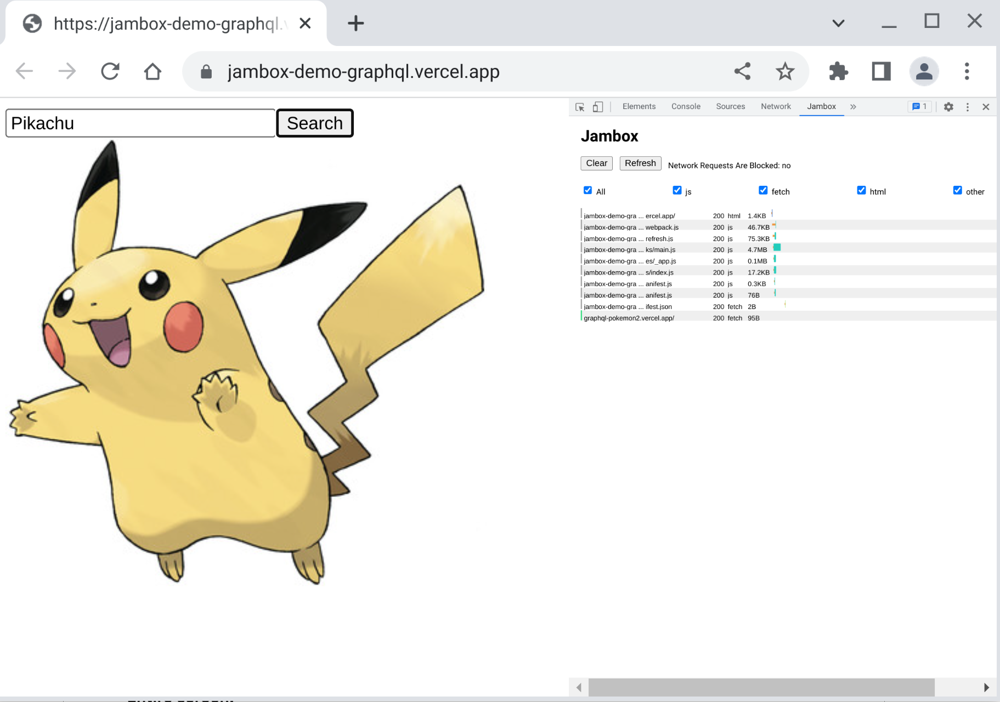
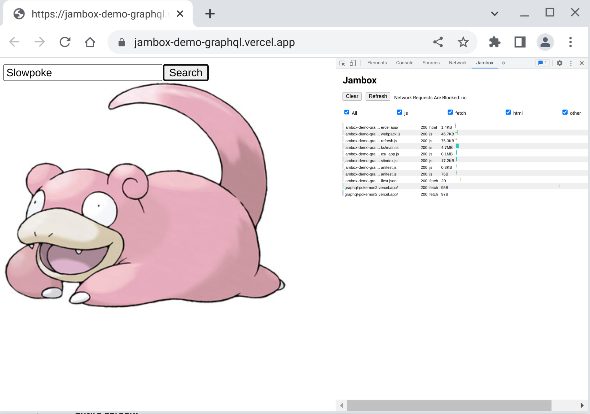

## NextJS + GraphQL Jambox Demo

## Install

Make sure to run `yarn` and `yarn build` at the root of this repo.

```
yarn
```

Set a `browser` option in `jambox.config.js` to either `chrome` or `chromium` based on
what you have installed on your system. The default is `chromium`.

## Run

```
❯ yarn dev
yarn dev
📻 Jambox 📻
Process launched
ready - started server on 0.0.0.0:3000, url: http://localhost:3000
event - compiled client and server successfully in 2.1s (167 modules)
wait  - compiling /_error (client and server)...
wait  - compiling / (client and server)...
event - compiled client and server successfully in 608 ms (171 modules)
warn  - Fast Refresh had to perform a full reload. Read more: https://nextjs.org/docs/basic-features/fast-refresh#how-it-works
```

## Visit the page

```
❯ yarn visit
📻 Jambox 📻
http://jambox-demo-graphql.vercel.app parsed as a URI. Launching a browser instance
chromium launched with 17172
Browser launched
```

A page should load at `http://jambox-demo-graphql.vercel.app`



Note that this URL is simply proxied to your local NextJS app at `localhost:3000`

Search for a couple of Pokemon, like "Picachu"



And "Slowpoke"



The GraphQL requests to `https://graphql-pokemon2.vercel.app` should work fine,
you can search for more images. Now we can turn off network requests in `jambox.config.js`

```
{
  blockNetworkRequests: true
}
```

Now try searching for additional Pokemon and notice how the requests fail. However the initial
requests should still work as they are cached in the `.jambox/` folder.

Because network requests are disabled you should no longer see images of Pokemon load. Instead
they should be replaced by a `200x200` placeholder `.jpeg`.

;
_Note: If images continue to load ensure that Chrome network cache is disabled._

Alternatively you may utilize the caching to persist the seen images of Pokemon to
disk an not show any placeholders. Add a `**/*.jpeg` to see for yourself.

```js
{
  cache: {
    stage: ['**/*.jpeg'];
  }
}
```

Enable network requests once again, and search the Pokemon images again to see the
difference.

## Notes

- You may clear the `.jambox` folder to start fresh.
- Check if jambox is running with `yarn jam ping`
- Shutdown the server with `yarn jam shutdown`
